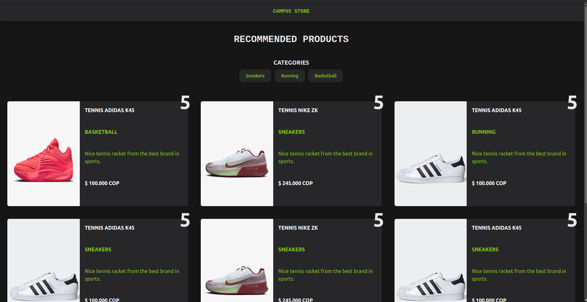

# CAMPUS STORE


## INSTALACIÓN

1. Clona este repositorio
```bash
https://github.com/Jean0405/FiltroReact.git
```
2. Deberas crear un archivo **.env** para las variables de entorno y pegar las que encontraras en el archivo **.env.example**.

* **NOTA**: En caso de no encontrar el archivo **.env.example** usa estas variables de entorno en el archivo **.env** que creaste

```.env
PORT=3300
HOST=127.25.25.26

DB_USER=jean0405
DB_PWD=yewisaje
DB_NAME=filtroReact
```

3. Ejecuta en la carpeta **server**.

```bash
npm install && npm run server
```

4. Ahora debes salir de server y entrar a la carpeta **client** y ejecutar.

```bash
npm install && npm run dev
```

5. Ingresa al URL que te muestra la terminal al ejecutar el frontend
